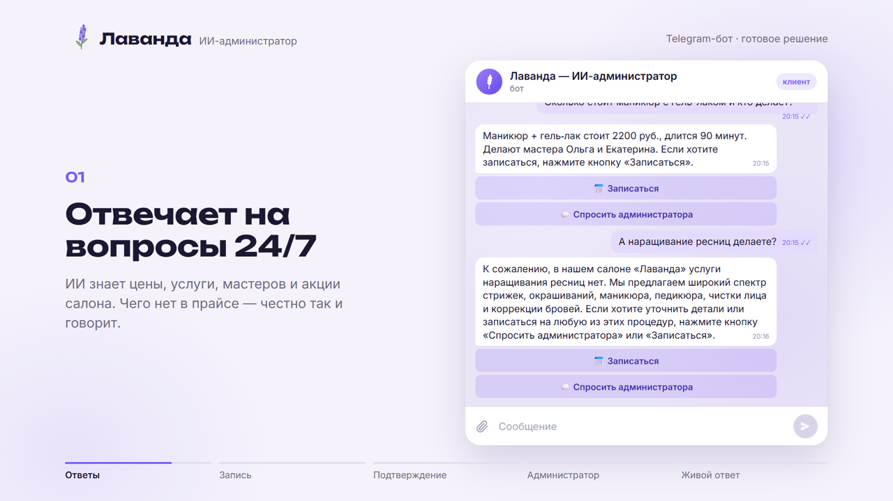
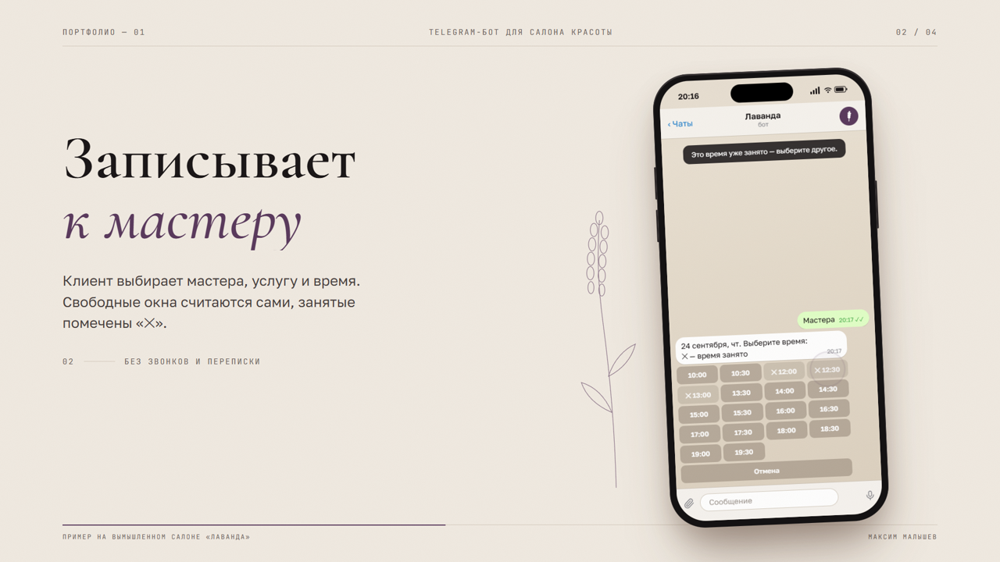
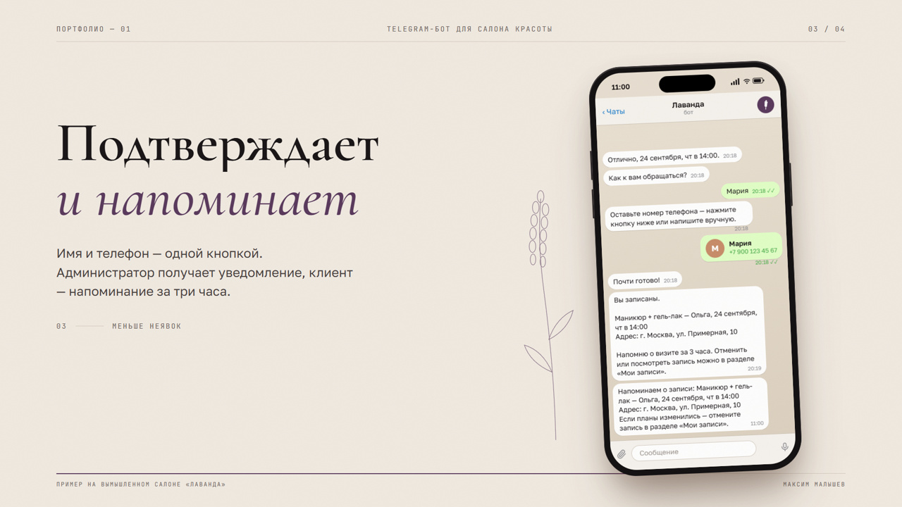
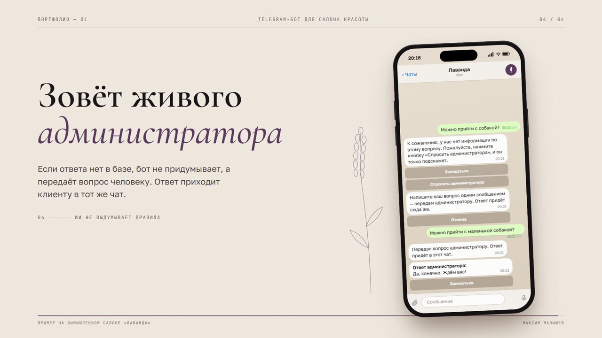

# ИИ-администратор салона красоты (Telegram и MAX)

Бот отвечает клиентам, записывает к мастеру и зовёт живого администратора, когда нужно. Работает круглосуточно в Telegram и в мессенджере MAX с общим расписанием.

**Попробовать:** [@malyshev_lavanda_bot](https://t.me/malyshev_lavanda_bot) · Автор: Максим Малышев, [@nfbl_c](https://t.me/nfbl_c)

> Готовое решение для салонов красоты. Показано на примере вымышленного салона «Лаванда»: подставьте свои услуги, мастеров и цены — и бот готов к работе.


## Что умеет

- **Отвечает на вопросы с помощью ИИ** строго по базе знаний салона: цены, услуги, акции, парковка, гарантии. Не выдумывает: чего нет в базе — передаёт администратору.
- **Записывает к мастеру**: можно начать с услуги или сразу выбрать мастера → день → время → имя и телефон → подтверждение. Свободные окна считаются автоматически с учётом длительности услуги, а занятое время помечено «✕» — но только если на него действительно есть запись.
- **Подключает живого администратора**: кнопка «Спросить администратора» пересылает вопрос в чат админа, админ отвечает реплаем — и ответ приходит клиенту в бот.
- **Напоминает клиенту** о визите за 3 часа.
- **Уведомляет администратора** о новых записях и отменах; команда `/bookings` показывает расписание на неделю.
- **Клиент сам отменяет запись** в разделе «Мои записи».

| Ответы по базе знаний | Свободное и занятое время |
|---|---|
|  |  |

| Подтверждение и напоминание | Живой администратор |
|---|---|
|  |  |

## Telegram и MAX одновременно

Тот же бот работает в мессенджере MAX (`max_bot.py`): меню, запись к мастеру, «Мои записи», напоминания и живой администратор. Записи из обоих мессенджеров хранятся в одной базе:

- время, занятое через Telegram, в MAX тоже показано занятым — и наоборот;
- администратор видит общее расписание (`/bookings`) с пометкой, откуда пришёл клиент;
- о записях из MAX администратор узнаёт в MAX, а если подключён Telegram-бот — ещё и в Telegram;
- напоминания и ответы администратора приходят клиенту в тот мессенджер, где он записывался.

Бизнесу не нужно выбирать один канал: клиенты пишут там, где им удобно, а расписание одно.

## Что это даёт бизнесу

| Проблема | Решение |
|---|---|
| Заявки теряются ночью и в выходные | Бот отвечает и записывает круглосуточно |
| Администратор отвечает на одни и те же вопросы | ИИ закрывает типовые вопросы сам, а сложные передаёт человеку |
| Клиенты забывают о записи и не приходят | Автоматическое напоминание |
| Нужна интеграция с CRM | Под заказчика подключается передача записей в amoCRM, Битрикс24, YCLIENTS или Google Таблицы |

## Стек

Python 3.11+, aiogram 3 (FSM), MAX Bot API (свой клиент на aiohttp), SQLite, LLM API: Groq, OpenRouter, OpenAI, Claude, Gemini или GigaChat — переключается в `.env`.

## Запуск

1. Создайте бота у [@BotFather](https://t.me/BotFather) и скопируйте токен.
2. Установите зависимости:
   ```
   pip install -r requirements.txt
   ```
3. Скопируйте `.env.example` в `.env` и впишите `BOT_TOKEN`.
4. Запустите:
   ```
   python bot.py
   ```
5. Отправьте боту `/myid`, впишите полученный ID в `ADMIN_CHAT_ID` и перезапустите бота, чтобы получать уведомления о записях и вопросы клиентов.

### Подключение ИИ

Без ключа бот работает в режиме `LLM_PROVIDER=none`: отвечает по FAQ поиском по ключевым словам. Для полноценного ИИ укажите провайдера и ключ в `.env` — готовые настройки для бесплатных Groq и OpenRouter есть в `.env.example`.

### Подключение MAX

1. Подключитесь к [платформе MAX для партнёров](https://business.max.ru/): создать бота может организация, ИП или самозанятый после проверки профиля. Перед публикацией бот проходит модерацию.
2. Создайте бота и впишите токен в `MAX_BOT_TOKEN`.
3. Запустите `python max_bot.py` (можно вместе с `bot.py` — база общая).
4. Отправьте боту в MAX `/myid` и впишите ID в `MAX_ADMIN_ID` — туда будут приходить записи и вопросы клиентов.

API MAX работает на сертификате НУЦ Минцифры. Корневой сертификат лежит в `certs/` и подключается только к запросам в MAX — системные настройки сервера не меняются.

## Как адаптировать под клиента

Весь контент лежит в двух файлах, код менять не нужно:
- `data/salon.json` — название, адрес, часы работы, услуги, цены, мастера;
- `data/faq.md` — частые вопросы, из которых ИИ берёт ответы.

## Структура

```
bot.py      — бот в Telegram: меню, запись, отмены, напоминания, ИИ-ответы, вопросы администратору
max_bot.py  — тот же бот в MAX
max_api.py  — клиент MAX Bot API
llm.py      — ИИ-ассистент с несколькими провайдерами
slots.py    — расчёт свободных и занятых окон мастера
db.py       — записи и вопросы из обоих мессенджеров (SQLite)
fmt.py      — форматирование дат и записей
salon.py    — загрузка данных салона и базы знаний
data/       — контент салона
certs/      — корневой сертификат Минцифры для API MAX
```

## Развёртывание на сервере

Подойдёт любой VPS с Ubuntu 22.04+ (1 ядро, 1 ГБ RAM хватит с запасом).

```
scp .env root@SERVER:/opt/salon-bot/.env     # один раз (предварительно: ssh root@SERVER mkdir -p /opt/salon-bot)
ssh root@SERVER 'bash -s' < deploy/setup.sh
```

Скрипт ставит зависимости, создаёт системного пользователя `bot` и сервисы с автозапуском и перезапуском при сбоях: `salon-bot`, если в `.env` есть `BOT_TOKEN`, и `salon-max-bot`, если есть `MAX_BOT_TOKEN`. Для обновления после `git push` достаточно запустить его ещё раз.

Логи: `journalctl -u salon-bot -f` и `journalctl -u salon-max-bot -f`

## Нужен такой бот для вашего бизнеса?

Адаптирую решение под ваш салон, клинику или студию за 1 день: ваши услуги, мастера, цены и база знаний. Также делаю ботов для записи, продаж и поддержки в других нишах — [@nfbl_c](https://t.me/nfbl_c).
